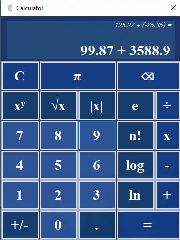

# C# Calculator
Fully functional calculator created in C#

A calculator that can handle basic arithmetic operations like:
  - Addition
  - Substraction
  - Multiplication
  - Division
  - Square roots
  - Exponentiation	

But also more useful operations like:
  - Absolute Value
  - Constants: Euler's number and PI
  - N Factorial (n!)
  - Log and LN
  - Ability to input decimal numbers
 
 >(If you get the following error: "Couldn't process file Form1.resx due to its being in the Internet or Restricted zone or having the mark of the web on the file. Remove the mark of the web if you want to process these files." then please go <a href="https://stackoverflow.com/questions/51348919/couldnt-process-file-resx-due-to-its-being-in-the-internet-or-restricted-zone-o" target="_blank">see this link</a>!
 
This version should be bug-free.


>


>
```
using System;
using System.Windows.Forms;

namespace CSharp
{
    public partial class Calculator : Form
    {
        public Calculator()
        {
            InitializeComponent();
        }
        string num1 = "0", num2 = "", operation = "";
        bool isLocked = false, signLock = false;

        private void opHandle(object sender, EventArgs e)
        {
            Button opBtn = (Button)sender;
            if(operation == "" && display.Text != "-")
            {
                operation = opBtn.Text;
                if (operation != "|x|" && operation != "√x" && operation != "n!" && operation != "log" && operation != "ln" && operation != "+/-" && operation != ".")
                {
                    if(operation == "xʸ")
                    {
                        display.Text = display.Text + " ^ ";
                    }
                    else {
                        display.Text = display.Text + " " + operation + " ";
                        isLocked = false; 
                    }
                }
                else
                {
                    switch (operation)
                    {
                        case "|x|":
                            lastOp.Text = "|" + display.Text + "| =";
                            display.Text = (Math.Abs(Convert.ToDouble(num1))).ToString();
                            break;
                        case "√x":
                            lastOp.Text = "√" + display.Text + " =";
                            display.Text = (Math.Sqrt(Convert.ToDouble(num1))).ToString();
                            break;
                        case "log":
                            lastOp.Text = "log(" + display.Text + ") =";
                            display.Text = (Math.Log10(Convert.ToDouble(num1))).ToString();
                            break;
                        case "ln":
                            lastOp.Text = "ln(" + display.Text + ") =";
                            display.Text = (Math.Log(Convert.ToDouble(num1))).ToString();
                            break;
                        case "+/-":
                            if (display.Text[0] == '-')
                            {
                                display.Text = (Math.Abs(Convert.ToDouble(display.Text))).ToString();
                            }
                            else
                            {
                                display.Text = "-" + display.Text;
                            }
                            break;
                        case ".":
                            if (!(num1.Contains(".")))
                            {
                                display.Text += ".";
                            }
                            break;
                        case "n!":
                            int factorial = 2;
                            for (int i = 3; i <= Convert.ToDouble(num1); i++)
                            {
                                factorial *= i;
                            }
                            lastOp.Text = num1 + "!";
                            num1 = factorial.ToString();
                            display.Text = num1;
                            break;
                    }
                    operation = "";
                    num1 = display.Text;
                }
            }
            else
            {
                string sign = opBtn.Text;
                if (sign == "+/-" && num2 != "")
                {
                    if (display.Text.ToString()[num1.Length + 2] != '-' && signLock == false)
                    {
                        display.Text = display.Text.Insert(num1.Length + 3, "(-");
                        num2 = display.Text.Remove(0, num1.Length + 4);
                        display.Text = display.Text.Insert(display.Text.Length, ")");
                        signLock = true;
                    }
                    else
                    {
                        display.Text = display.Text.Remove(num1.Length + 3, 2);
                        display.Text = display.Text.Remove(display.Text.Length - 1, 1);
                        num2 = display.Text.Remove(0, num1.Length + 3);
                        signLock = false;
                    }
                    sign = "";
                }
                if (sign == ".")
                {
                    if (!(display.Text.Remove(0, num1.Length + 3).Contains(".")))
                    {
                        if (signLock == false)
                        {
                            display.Text += ".";
                            num2 = display.Text.Remove(0, num1.Length + 3);
                        }
                        else
                        {
                            display.Text = display.Text.Insert(display.Text.Length - 1, ".");
                            display.Text = display.Text.Remove(display.Text.Length - 1, 1);
                            num2 = display.Text.Remove(0, num1.Length + 4);
                            display.Text = display.Text.Insert(display.Text.Length, ")");

                        }
                    }
                }
            }
        }

        private void clear_Click(object sender, EventArgs e)
        {
            num1 = "0";
            num2 = "";
            operation = "";
            display.Text = "0";
            lastOp.Text = "0 + 0 =";
            signLock = false;
            isLocked = false;
        }

        private void backspace_Click(object sender, EventArgs e)
        {
            if (operation == "")
            {
                display.Text = display.Text.Substring(0, display.Text.Length - 1);
                if (display.Text.Length == 0)
                {
                    display.Text = "0";
                }
                num1 = display.Text;
            }
            else
            {
                if (display.Text.Length > num1.Length + 4)
                {
                    if (signLock == false)
                    {
                        display.Text = display.Text.Substring(0, display.Text.Length - 1);
                        num2 = display.Text.Remove(0, num1.Length + 3);
                    }
                    else
                    {
                        if (display.Text.Length > num1.Length + 6)
                        {
                            display.Text = display.Text.Remove(display.Text.Length - 2, 2);
                            num2 = display.Text.Remove(0, num1.Length + 4);
                            display.Text = display.Text.Insert(display.Text.Length, ")");
                        }
                        if(display.Text.Length == num1.Length + 6)
                        {
                            display.Text = display.Text.Insert(display.Text.Length - 1, "0");
                        }
                    }
                }
                else if(display.Text.Length > num1.Length + 3)
                {
                    display.Text = display.Text.Substring(0, display.Text.Length - 1);
                    num2 = "0";
                }
                if(num2 == "-" || num2 == "")
                {
                    num2 = "0";
                }
            }
        }

        private void equal_Click(object sender, EventArgs e)
        {
            lastOp.Text = display.Text + " =";
            if (num2 != "")
            {
                switch (operation)
                {
                    case "+":
                        display.Text = (Convert.ToDouble(num1) + Convert.ToDouble(num2)).ToString();
                        break;
                    case "-":
                        display.Text = (Convert.ToDouble(num1) - Convert.ToDouble(num2)).ToString();
                        break;
                    case "x":
                        display.Text = (Convert.ToDouble(num1) * Convert.ToDouble(num2)).ToString();
                        break;
                    case "÷":
                        display.Text = (Convert.ToDouble(num1) / Convert.ToDouble(num2)).ToString();
                        break;
                    case "xʸ":
                        display.Text = (Math.Pow(Convert.ToDouble(num1), Convert.ToDouble(num2))).ToString();
                        break;
                }
                operation = "";
                num1 = display.Text;
                num2 = "";
                signLock = false;
            }
        }

        private void numHandler(object sender, EventArgs e)
        {
            Button btnClicked = (Button)sender;
            if (display.Text == "0") {
                isLocked = true;
                switch (btnClicked.Text)
                {
                    case "π":
                        display.Text = (Math.PI).ToString();
                        break;
                    case "e":
                        display.Text = (Math.E).ToString();
                        break;
                    default:
                        display.Text = btnClicked.Text;
                        break;
                } 
            }
            else
            {
                switch (btnClicked.Text)
                {
                    case "π":
                        if (isLocked == false)
                        {
                            display.Text += (Math.PI).ToString();
                            isLocked = true;
                        }
                        break;
                    case "e":
                        if (isLocked == false)
                        {
                            display.Text += (Math.E).ToString();
                            isLocked = true;
                        }
                        break;
                    default:
                        if (signLock == false)
                        {
                            display.Text += btnClicked.Text;
                        }
                        isLocked = true;
                        break;
                }
            }
            if (operation == "")
            {
                num1 = display.Text;
            }
            else
            {
                isLocked = true;
                switch (btnClicked.Text)
                {
                    case "π":
                        num2 = (Math.PI).ToString();
                        display.Text = display.Text.Remove(num1.Length + 3, display.Text.Length-num1.Length-3) + (Math.PI).ToString();
                        break;
                    case "e":
                        num2 = (Math.E).ToString();
                        display.Text = display.Text.Remove(num1.Length + 3, display.Text.Length - num1.Length - 3) + (Math.E).ToString();
                        break;
                    default:
                        if (signLock == false)
                        {
                            num2 += btnClicked.Text;
                        }
                        else
                        {
                            if (display.Text.Remove(0, num1.Length + 5) != "0)")
                            {
                                display.Text = display.Text.Insert(display.Text.Length - 1, btnClicked.Text);
                                display.Text = display.Text.Remove(display.Text.Length - 1, 1);
                            }
                            else
                            {
                                display.Text = display.Text.Insert(display.Text.Length - 2, btnClicked.Text);
                                display.Text = display.Text.Remove(display.Text.ToString().Length - 2, 2);
                            }
                            num2 = display.Text.Remove(0, num1.Length + 4);
                            display.Text = display.Text.Insert(display.Text.Length, ")");
                        }
                        break;
                }
            }
        }
    }
}
```
